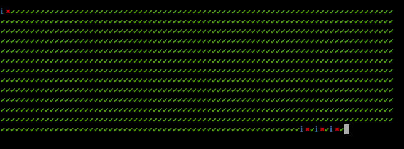
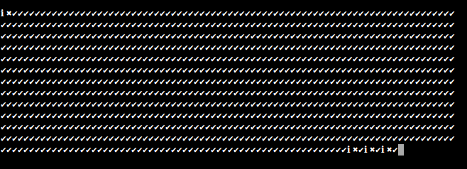
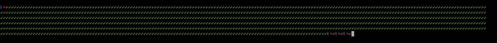
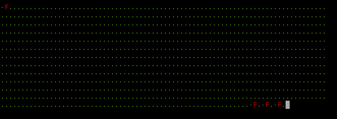
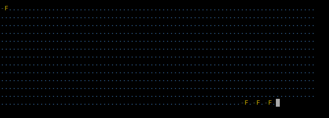

# Karma-super-dots-reporter
> Karma reporter plugin with dots style highly configurable.

Display a success, failure or ignore icon for each test. It don't display the reason and stack trace of each failure test unlike default dots karma reporter.

To display a nice reasons and stack traces of failure tests, please consider another plugin in addition of this one, like [karma-mocha-reporter](https://github.com/litixsoft/karma-mocha-reporter).

## How does it look like
If colors karma options is true (true by default);


If colors karma options is false:


## Installation
The easiest way is to keep `karma-super-dots-reporter` as a devDependency in your `package.json`.
```json
{
  "devDependencies": {
    "karma": "^0.12",
    "karma-super-dots-reporter": "^0.3.0"
  }
}
```

You can simple do it by:

    $ npm install karma-super-dots-reporter --save-dev

## Configuration
```javascript
// karma.conf.js
module.exports = function(config) {
  config.set({
    // reporters configuration
    reporters: ['super-dots']
  });
};
```

## Options
### nbDotsPerLine
**Type:** Number

**Default Values:** 80

Define the number of "dots" per line in the console.

**Example:**
```javascript
// karma.conf.js
module.exports = function(config) {
  config.set({
    // reporters configuration
    reporters: ['super-dots'],

    superDotsReporter: {
      nbDotsPerLine : 180
    }
  });
};
```



### icon
**Type:** Object

**Default Values:**
```javascript
{
    icon: {
        success : '✔',
        failure : '✖',
        ignore  : 'ℹ'
    }
}
```

Define which icons are displayed in case of success, failure and ignore.

**Example:**
```javascript
// karma.conf.js
module.exports = function(config) {
  config.set({
    // reporters configuration
    reporters: ['super-dots'],

    superDotsReporter: {
      icon: {
        success : '.',
        failure : 'F',
        ignore  : '-'
      }
    }
  });
};
```




### color
**Type:** Object

**Default Values:**
```javascript
{
    color: {
        success : 'green',
        failure : 'red',
        ignore  : 'blue'
    }
}
```

Define which colors are applied on icons in case of success, failure and ignore.

Use the [chalk colors](https://github.com/sindresorhus/chalk#colors) to customize it.

**Example:**
```javascript
// karma.conf.js
module.exports = function(config) {
  config.set({
    // reporters configuration
    reporters: ['super-dots'],

    superDotsReporter: {
      color: {
        success : 'blue',
        failure : 'yellow',
        ignore  : 'grey'
      }
    }
  });
};
```




